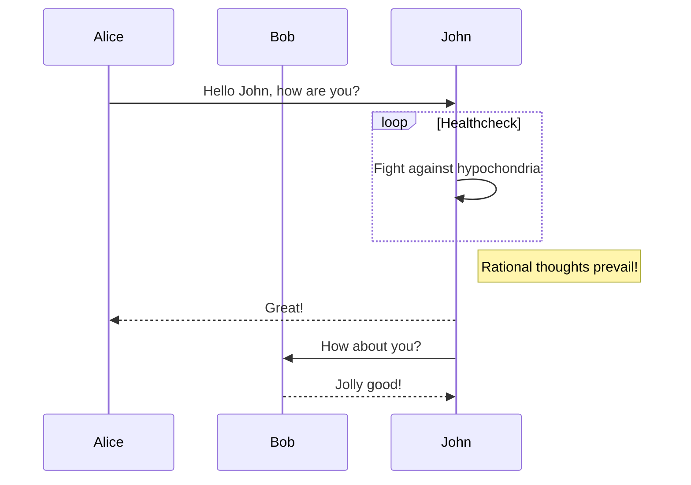

# Sequence Bounds Layout Design

## Context

GitHub issue 202 reports overlapping labels and boxes in sequence diagrams that combine a loop fragment, a self-message, and a note:

The current renderer mostly advances the sequence timeline with fixed spacing. Mermaid uses a bounds-first sequence layout: messages, notes, activations, and fragments insert their real extents into a shared bounds model before final drawing. The selected direction is to fix the general class of overlap bugs by adopting a small Selkie sequence layout model, guarded by eval overlap detection.

## Goals

- Prevent overlap between sequence fragment labels/frames, self-message labels/paths, and notes.
- Match Mermaid's layout behavior more closely for sequence bounds and vertical spacing.
- Add eval coverage that detects sequence-specific label and box overlap before and after the renderer change.
- Keep SVG rendering behavior and z-order stable where possible.

## Non-Goals

- Pixel-perfect Mermaid parity for all sequence diagrams.
- A general browser-grade SVG text measurement engine.
- A public layout API outside the sequence renderer.
- Unrelated sequence styling or color changes.

## Architecture

Add a sequence-specific layout phase before SVG elements are emitted. The layout phase should produce positioned models:

- `ActorLayout`: actor key, label, x, center x, actor box bounds, lifeline bounds.
- `MessageLayout`: from/to actors, y position, line/path bounds, label bounds, and self-message extent.
- `NoteLayout`: placement, x/y/width/height, and text bounds.
- `FragmentLayout`: kind, label, start/end y, x/width, nested depth, and section dividers.
- `ActivationLayout`: actor, x, start/end y, and stack offset.

Rendering becomes a second pass over those models. The first pass owns spacing and bounds; the second pass owns SVG shape creation and z-order.

The first implementation can keep the layout structs private in `src/render/sequence.rs`. If the module becomes too large, split them into `src/render/sequence/layout.rs` after the behavior is working.

## Layout Behavior

The layout pass should mirror these Mermaid behaviors:

- Every visible event inserts a bounding box into the active fragment stack.
- Self-messages reserve extra vertical height and expand horizontal bounds around the actor.
- Notes reserve height from line count plus padding, not a fixed constant.
- Fragment boxes derive their top, bottom, left, and right from enclosed event bounds plus `boxMargin`.
- Nested fragments expand by depth so inner and outer frames do not share the same border.
- Fragment starts and section dividers reserve vertical room for their header labels.
- Actor gap calculation should include pressure from self-messages and notes where those extend beyond normal actor spacing. Compute that pressure in a pre-scan over messages and notes before the vertical event layout pass; fragment bounds should then use the resulting actor positions, not feed back into actor spacing.

Use an internal `SequenceLayoutConfig` to centralize actor dimensions, message margin, note margin, box margin, label box dimensions, and font metrics.

Note height should be calculated from text line count plus vertical padding, with a minimum height matching the current one-line note height. This keeps simple note diagrams stable while allowing multi-line notes to reserve enough space.

## Eval And Testing

Add a failing renderer regression test for the issue 202 source in `tests/sequence_rendering.rs`. The test should parse the SVG and assert semantic separation between:

- the self-message label `Fight against hypochondria`
- the loop label/header `Healthcheck`
- the note text `Rational thoughts prevail!`
- the note box and loop frame

Add sequence-specific eval overlap detection rather than a generic SVG geometry check. It should extract approximate boxes for:

- `text.messageText`
- `text.noteText`
- `text.loopText`
- `rect.note`
- fragment frame extents from `.loopLine` line groups

The detector should flag hard overlaps between text boxes and note/fragment boxes when they are not the text's owning container. Use conservative text dimensions from existing font assumptions and line counts.

The acceptance rule is: semantic boxes for sequence labels, note rectangles, and fragment frames must not intersect after a 4 px tolerance is applied. A semantic box is the approximate visible rectangle for one of the extracted sequence elements above. Intersections with the element's own container are allowed.

The detector should not flag:

- lifeline crossings
- message lines under labels
- note text inside its own note rectangle
- loop label text inside its own label/header area

Keep the first detector sequence-only. Geometry helpers can be private to the eval module and should not be promoted to generic shared infrastructure until another diagram type needs them.

Testing layers:

1. Unit test box intersection helpers with allowed padding.
2. Add the issue 202 renderer regression test.
3. Add or update eval checks so `cargo run --features eval --bin selkie -- eval --type sequence` reports fewer sequence overlap issues after the renderer fix.
4. Keep existing sequence tests for shape classes, labels, autonumber, activations, and self-message paths.

## Implementation Plan Shape

The later implementation plan should follow this order:

1. Add the overlap detector and failing issue 202 test.
2. Introduce `SequenceLayoutConfig` and actor layout structs.
3. Build event layout for normal messages, self-messages, notes, fragments, and activations.
4. Render from layout models while preserving existing z-order.
5. Run focused tests and eval, inspect issue 202 output, and adjust spacing constants.
6. Update affected sequence SVGs in `docs/images` only after eval confirms improvement.
7. Run `cargo fmt`, `cargo clippy --features all-formats -- -D warnings`, and `cargo test --features all-formats`.

## Risks

- Approximate text measurement can miss or over-report collisions. Keep the first eval detector conservative and sequence-specific.
- Bounds-first layout may change many sequence sample dimensions. Treat broad dimension changes as acceptable only if eval similarity and overlap behavior improve.
- Nested fragments can regress if fragment bounds are patched per kind. Use one fragment-stack mechanism for loop, alt, opt, par, critical, break, and rect.
- Current docs image changes can be noisy. Update docs images only after implementation, not during the design phase.
